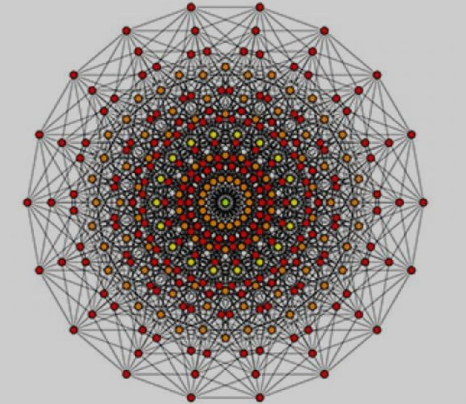

# Data/Network Analyst

#### Technical Skills: Python, SQL, NoSQL, Power Bi, Microsoft excel, MATLAB
## Education
- Post. Cert.,  Data Analysis & Artificial Intelligence          | Saskatchewan Polytechnic Canada (December 2023)
- M.Sc., 	       Electronics Engineering   		  | University of KwaZulu-Natal, South Africa (April 2015)
- B.Sc., 	       Computer Engineering       		  | Ladoke Akintola University, Nigeria (December 2010)  

## Work Experience

**Postgraduate Data Analyst @ Computer Systems Engineering Department, Tshwane University of Technology (January 2019 – Present)**
- Conducted comprehensive data collection, processing, and analysis to drive insights for bankruptcy prediction projects.
- Implemented advanced optimization algorithms to enhance feature selection methodologies, resulting in notable enhancements in model performance for bankruptcy prediction tasks.
- Employed a variety of data balancing techniques and innovative approaches to address high dimensionality challenges, effectively enhancing dataset balance and reducing dimensionality.
- Utilized a diverse array of supervised, unsupervised, and deep learning methodologies to develop robust predictive models for bankruptcy prediction, leveraging cutting-edge techniques to achieve accurate and actionable results.

**Lecturer @ Tshwane University of Technology, Pretoria, South Africa (February 2019 – December 2022)**

- Curriculum Development and Course Design: Led the creation of lecture materials, assessments, and related documents to align with academic standards and institutional goals.
- Dynamic Classroom Instruction: Provided engaging lectures across departmental courses, using innovative teaching strategies to enhance student learning.
- Student Assessment and Evaluation: Administered rigorous assessments and examinations to gauge student comprehension and mastery of course content, providing constructive feedback to facilitate academic growth.
- Academic Administration: Managed academic records and student marks efficiently, collaborating with departmental leadership to uphold university policies.
- Research Supervision and Mentorship: Offered guidance and mentorship to students conducting research projects, fostering academic excellence and scholarly inquiry.
- Professional Development Initiatives: Engaged in continuous professional development activities, attending workshops, conferences, and training sessions to enhance pedagogical skills and stay abreast of emerging trends in higher education.

	 
**Tutor @  University of KwaZulu-Natal, Durban, South Africa (September 2013 – December 2018)**

- Student Support and Guidance: Offered academic support sessions to aid students in understanding course material, clarifying concepts, and enhancing study skills.
- Facilitation of Learning: Created a supportive and engaging environment for student-centered learning, encouraging participation and question asking.
- Feedback and Assessment: Offered constructive feedback on assignments, and academic work to enhance critical thinking skills and identify areas for improvement in students.
- Study Skills Development: Provided guidance on effective study techniques, time management, note-taking strategies, and exam preparation to optimize students' learning.
- Subject Matter Expertise: Demonstrated expertise in the tutored subject, staying current with relevant literature and methodologies to support students effectively.
- Resource Provision: Directed students to supplementary learning resources, including textbooks, online tutorials, academic journals, and research databases.
- Communication and Collaboration: Maintained open communication with stakeholders to ensure alignment with course objectives and student learning outcomes.

**IT Data Analyst @ Dabar Object Solutions              (January 2011 – Aug. 2013)**

- Comprehensive Data Analysis: Conducted in-depth analysis of Dabar-object software data to inform strategic decision-making and enhance business performance.
- Data Management and Security: Implemented robust protocols for data processing, storage, archiving, and encryption to safeguard sensitive information and maintain data integrity and confidentiality.
- Technical Support Expertise: Offered core technical support for companies using Dabar-object software, resolving issues promptly to ensure seamless IT system operation.
- Computer System Configuration and Maintenance: Ensured optimal performance, and compatibility of computer systems with Dabar-object software and associated technologies.
- Internet Support Services: Provided comprehensive support, addressing connectivity issues and optimizing internet performance for smooth business operations.

**Network Analyst @ Tertiary Education Trust FUND 	 (December 2011 – June 2013)**

- Computer System Configuration and Maintenance: Oversaw system setups for peak performance, ensuring smooth operation of network infrastructure and related technologies.
- Internet  and Software Support: Offered full internet support and conducted software installations to enhance online resource accessibility and organizational productivity.
- Network Troubleshooting: Diagnosed and resolved connectivity issues, outages, and performance bottlenecks to ensure uninterrupted network services and minimize downtime.

  
**Network Analyst Intern @ National Agency for Science and Engineering Infrastructure 	(February. 2009 – Nov 2011)**

- LAN Setup and Subnetting: Designed and configured local area networks (LANs), including subnetting to optimize network performance, enhance data transmission efficiency.
- IP Address Management: Managed and assigned IP addresses within the network infrastructure, ensuring proper allocation and utilization of resources.
- Router Configuration: Managed router setups to optimize data routing between diverse networks, ensuring dependable and secure data transmission across the network.
- Network Troubleshooting: Identified and resolved network issues swiftly, addressing connectivity problems.

## Projects

**Financial Distress Prediction**

Bankruptcy represents a significant and undesirable event within the economic landscape, bearing lasting negative consequences that reverberate across various sectors. Its impacts extend beyond immediate stakeholders to encompass business owners, shareholders, investors, policymakers, employees, and governmental entities. The global reverberations of the Lehman Brothers' financial crisis of 2008 serve as a poignant reminder of the far-reaching ramifications of such events.

In the research endeavors, a comprehensive methodological approach has been undertaken to address financial distress, encompassing both bankruptcy and credit scoring considerations. The methodology incorporates strategies tailored to mitigate challenges inherent in bankruptcy datasets, including issues such as high dimensionality, class imbalance, and missing values. To tackle these complexities, advanced computational techniques, including but not limited to improved particle swarm optimization (PSO) and genetic algorithms (GA), have been employed. A range of deep learning and machine learning algorithms have been employed to develop models with optimal performance in terms of accuracy and other metrics. Furthermore, techniques have been utilized to address high dimensionality and imbalance within the datasets, facilitating comprehensive comparisons.

To address financial distress, advanced computational techniques like PSO and GA are employed, mitigating challenges in bankruptcy datasets such as high dimensionality and class imbalance. **The Effect of Imbalanced Data and Parameter Selection via Genetic Algorithm Long Short-Term Memory (LSTM) for Financial Distress Prediction**
<!---[Publication](chrome-extension://efaidnbmnnnibpcajpcglclefindmkaj/https://www.iaeng.org/IJAM/issues_v53/issue_3/IJAM_53_3_04.pdf)-->

Research employs a methodological approach integrating deep learning and machine learning algorithms for optimal model performance.
A novel method combines PSO and LSTM systems, outperforming traditional models in predicting bankruptcy, as demonstrated through evaluation using real-life datasets. **Application of an Improved Optimization Using Learning Strategies and Long Short Term-Memory for Bankruptcy Prediction** 
<!---[Publication](chrome-extension://efaidnbmnnnibpcajpcglclefindmkaj/https://www.iaeng.org/IJCS/issues_v50/issue_2/IJCS_50_2_21.pdf)-->

Similarly, in stock market prediction, a stacked LSTM network model proves effective in analyzing historical data for accurate future predictions. **Stock Market Behaviour Prediction using Stacked LSTM Networks**
[Publication](ieeexplore.ieee.org/abstract/document/9015840)

In bankruptcy prediction, a hybrid PCA-ANN model stands out, surpassing others in accuracy when evaluated against dataset factors like training/testing ratios. **Financial Distress Prediction: Principle Component Analysis and Artificial Neural Networks**
[Publication](https://ieeexplore.ieee.org/abstract/document/9015884)

## Publications

1. Adisa, J.A., Ojo, S., Owolawi, P.A., Pretorius, A. and Ojo, S.O., 2023. Application of an improved optimization using learning strategies and long short term-memory for bankruptcy prediction. IAENG International Journal of Computer Science, 50(2), pp.512-524.
<!---[Publication](chrome-extension://efaidnbmnnnibpcajpcglclefindmkaj/https://www.iaeng.org/IJCS/issues_v50/issue_2/IJCS_50_2_21.pdf)-->

2. Adisa, J.A., Ojo, S., Owolawi, P.A., Pretorius, A. and Ojo, S.O., 2023. The Effect of Imbalanced Data and Parameter Selection via Genetic Algorithm Long Short-Term Memory (LSTM) for Financial Distress Prediction. IAENG International Journal of Applied Mathematics, 53(3), pp.25-38.
<!---[Publication](chrome-extension://efaidnbmnnnibpcajpcglclefindmkaj/https://www.iaeng.org/IJAM/issues_v53/issue_3/IJAM_53_3_04.pdf)-->

3. Adisa, J., Ojo, S., Owolawi, P., Pretorius, A. and Ojo, S.O., 2022, March. Credit score prediction using genetic algorithm-lstm technique. In 2022 Conference on Information Communications Technology and Society (ICTAS) (pp. 1-6). IEEE. [here](https://ieeexplore.ieee.org/abstract/document/9744714)

4. Ojo, S.O., Adisa, J.A., Owolawi, P.A., Du, C.T. and Mphahlele, M., 2020, December. Stock market behaviour prediction using long short-term memory network and gated recurrent unit. In 2020 International Conference on Computational Science and Computational Intelligence (CSCI) (pp. 615-621). IEEE.
   [here](https://ieeexplore.ieee.org/abstract/document/9458150)

5. Adisa, J.A., Ojo, S.O., Owolawi, P.A. and Pretorius, A.B., 2019, November. Financial distress prediction: Principle component analysis and artificial neural networks. In 2019 International Multidisciplinary Information Technology and Engineering Conference (IMITEC) (pp. 1-6). IEEE.[here](https://ieeexplore.ieee.org/abstract/document/9015884)

6. Ojo, S.O., Owolawi, P.A., Mphahlele, M. and Adisa, J.A., 2019, November. Stock market behaviour prediction using stacked LSTM networks. In 2019 International multidisciplinary information technology and engineering conference (IMITEC) (pp. 1-5). IEEE. [here](https://ieeexplore.ieee.org/abstract/document/9015840)

   

